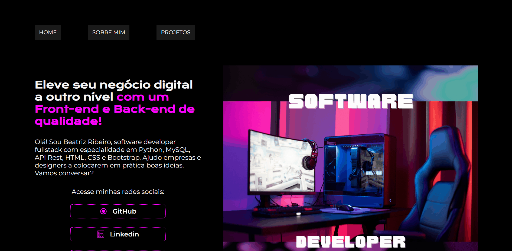

<h1 align="center">
  💻 Portfólio - Beatriz Ribeiro
</h1>

<h4 align="center"><a href="#">Clique para visitar o projeto</a></h4>

## 📚 Menu

O site é composto por três opções de menu:

- **Home:** Nele temos uma breve apresentação e informações sobre minhas redes sociais para contato;
- **Sobre mim:** Uma breve descrição falando um pouco sobre quem sou e minhas experiências na área de TI;
- **Projetos:** Apresentação de alguns projetos desenvolvidos com link direto para os respectivos códigos no GitHub;

---

## 💼 Tecnologias utilizadas

Para o desenvolvimento deste portifólio utilizei as seguintes tecnologias:

- HTML;
- CSS;
- JavaScript;

---

<h2>Autora</h2>

<table>
    <b>Beatriz Ribeiro</b>
</table>